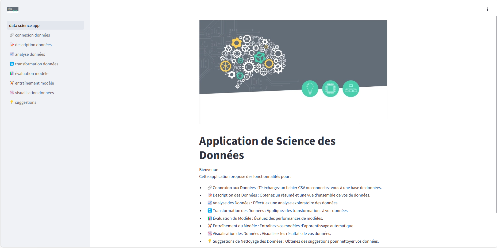

# 32123BC6-Data-Science

## Application Prédictive Interactive avec Streamlit

Ce document détaille le développement d'une application prédictive interactive, conçue avec Streamlit. Streamlit est une bibliothèque Python avancée pour la création d'applications web dédiées à la science des données. L'objectif principal de cette application est de rendre l'intelligence artificielle plus accessible aux personnes n'ayant pas de compétences avancées en programmation ou en science des données. Pour ce faire, l'application utilise divers jeux de données, comme ceux concernant le vin et le diabète, pour illustrer l'application des modèles de classification et de régression.

## Fonctionnalités

- **Téléchargement et Sélection de Fonctionnalités** : Téléchargez des ensembles de données ou connectez-vous à des sources de données pour sélectionner des fonctionnalités et des colonnes cibles.
- **Entraînement de Modèles** : Entraînez divers modèles tels que la Régression Linéaire, la Régression Logistique, les Arbres de Décision, SVM, Naive Bayes et Forêts Aléatoires.
- **Évaluation de Modèles** : Fournit des métriques d'évaluation telles que l'Exactitude, la Précision, le Rappel, le F-score et ROC-AUC pour évaluer les performances des modèles.
- **Comparaison de Modèles** : Permet la comparaison côte à côte des métriques de performance entre plusieurs modèles entraînés.
- **Téléchargement des Modèles Entraînés** : Exportez les modèles entraînés au format .pkl pour un déploiement ultérieur ou une analyse approfondie.

## Installation

1. **Clonez le dépôt**:
   ```bash
   git clone https://github.com/Diginamic-M09-Gr3/32123BC6-Data-Science.git
   cd 32123BC6-Data-Science
   ```
   
2. **Créez un environnement virtuel (venv)**:
   ```bash
   python -m venv env
   ```
   
3. **Activez l'environnement virtuel (sous Windows)**:
   ```bash
   .\env\Scripts\activate
   ```
   **Sous macOS/Linux**:
   ```bash
   source env/bin/activate
   ```
   
4. **Installez les dépendances**:
   ```bash
    pip install -r requirements.txt
   ```

5. **Exécutez l'application Streamlit**:
   ```bash
    streamlit run my_app.py
   ```

6. **Ouvrez l'application dans votre navigateur**:
   ```bash
    Local URL: http://localhost:8501
   ```

## Utilisation

    1. Téléchargement ou Connexion aux Données :
        Téléchargez votre ensemble de données à l'aide du widget de téléchargement de fichiers ou connectez-vous à une source de données.
    
    2. Select Features and Target Column:
        Choisissez les fonctionnalités à inclure dans le modèle et sélectionnez la colonne cible pour la prédiction.

    3. Entraînement du Modèle :
        Sélectionnez un modèle d'apprentissage automatique dans le menu déroulant.
        Ajustez les paramètres si nécessaire et cliquez sur "Entraîner le Modèle".

    4. Évaluation du Modèle :
        Après l'entraînement, des métriques d'évaluation telles que l'Exactitude, la Précision, le Rappel et le F-score sont affichées.
        La courbe ROC et l'AUC sont affichées pour les modèles de classification binaire.

    5. Comparaison des Modèles :
        Sélectionnez plusieurs modèles entraînés pour les comparer en utilisant leurs identifiants uniques.
        Évaluez et comparez les métriques de performance des modèles sélectionnés.

    6. Téléchargement des Modèles Entraînés :
        Téléchargez les modèles entraînés au format .pkl pour une utilisation future ou un déploiement.

## Technologies Utilisées
- **Python**
- **Streamlit**
- **Scikit-learn**
- **Pandas**

## Conclusion
En conclusion, cette application vise à transformer l'accès à l'intelligence artificielle, en la rendant utilisable et bénéfique pour un public plus large. En intégrant des fonctionnalités avancées et en rendant l'apprentissage automatique plus intuitif et interactif, nous ouvrons la porte à des innovations significatives dans la manière dont les données sont analysées et utilisées dans divers domaines.

## Contributeurs
- **Alfred Christopher**
- **Berrabah Fatima**
- **Cormerais Dorian**
- **Mougani Christ**

## Captures d'écran

